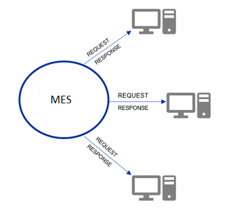
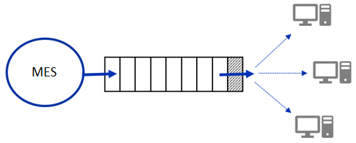
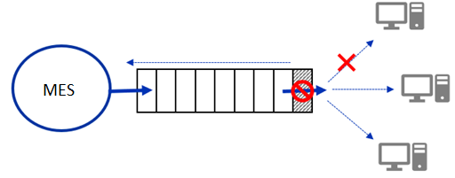
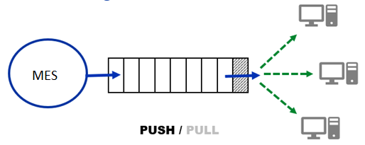
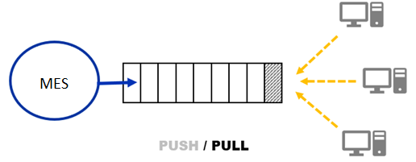

# Event Framework

## __Objective__

Create ability for application to allow other systems to react to events created within it without polling the master system.  

Consumers can be diverse from windows, web or workflow applications. They can be slow or fast. Framework should cater to all the consumers.

There is also possibility that some consumers may stop or disconnect but they should not miss any notifications.

The solution should be responsive, efficient, scalable and reliable.

## __Application Information__

The application under consideration is an existing Manufacturing Execution System (MES). It is a computerized system used in manufacturing to track and document the transformation of raw materials to finished goods. MES works in real time to enable the control of multiple elements of the production process (e.g. inputs, personnel, machines and support services)

MES application sits between the L2 layer like SCADA (Supervisory control and data acquisition) and L4 layer like ERP (Enterprise resource planning).

## __Problem__

MES is an enterprise application which keeps track of all the activity on the plant floor. This information is stored in MES database and can be fetched by other systems only through the mechanism of REST based web services.

External systems need to poll the MES application for any changes that have happened in the system. This causes a large amount of API calls to the MES system just to get information for any changes in the system.

## __Solution__

Create ability in MES to inform external applications on any changes in MES as soon as they happen without the external applications polling MES.

MES records events related to process order status changes, batch events, stock events, inventory events, validated document changes, process variable changes, input consumption and output production events. 

## __Architecture Review__
---

### 1. Synchronous Communication
---

In synchronous communication both the parties in the communication actively have an established channel and communicate over it with each other. 

In this case both the parties need to be continously listening over the channel and cannot disconnect and resume on a later point in time. 

This is more like a human to human interaction where both human need to be present for a conversation. One human requests for some information or provides some information and the other person responds with the information or acknowledges that he / she received the information.

Typically in software systems, these conversations are modelled using request / response based services like WCF (Windows Communication Foundation), RPC, Web APIs etc

#### PROS

* Simple request / response based services
* Easy to develop, standardized .NET tools for creating services, widely used
* Easy to visualize, debug and direct communication
* Ideal for non-durable communication

#### CONS

* Tightly Coupled
* Wait time for consumer to accept, process and respond to request
* Blocking
* Latency (Dependency)
* Non-Durable - Consumer needs to be actively listening for requests

It is not possible that all the consumers will be online at all times. It would either mean that the event producer will have to wait for all the consumers to be online or accept the fact that some consumers (which were offline) will miss the message. For a reliable event based system, this is not acceptable. Losing a status change message or Batch created event would be a big issue for external systems.

### 2. Asynchronous Communication
---

Keeping both the parties in communication active is not possible all the time. In such an event there is a loss of information or the request needs to wait till the time both the parties are able to talk to each other.

Asynchronous communication allows the parties to not actively listen for messages. Instead they can when send or receive messages based on their convenience. The sender does not expect to receive response immediately. Rather it can be processed at the receiver end when the receiver is free to process it. This allows the two parties to be loosely coupled or dependent on each other.

This is mostly achieved using some queue mechanism like MSMQ, SQS, NServicebus, RabbitMQ etc where the sender sends the message to the queue and receiver either queries or receives the message from the queue.

Such a durable form of communication is ideal in the case of 1:1 producer / consumer scenario where the broker can retry message to the consumer in case it is offline.

For a multi consumer scenario, this becomes complex as the broker needs to determine which consumers received the message and which did not receive the message. In this case, the broker needs to make a decision if the message needs to be retried for the failed consumers or forget the message causing loss of message for the failed consumers.

Managing state of message delivery though possible is complex. Losing messages is not as per requirement and hence retrying is the only option. For retrying, the message will need to be queued again in the system for specific consumers. These messages will move to the back of the queue and cause incorrect order of messages being received at the consumer.

#### PROS

* Loosely coupled
* No Wait or Producer of events
* No Blocking of producer for sending events
* Durable communication
* Low Latency

#### CONS

* Queue Based (Order not guaranteed)
* Decision for handling disconnections
* Manage retry / repeat for specific consumers
* Ability to overwhelm consumers
* Ideal for message processing rather than event framework

### 3. Push vs Pull
---

Another aspect to consider for the architecture would be whether to push events to the consumers or let the consumers pull the information from the source.

**Push Based System**

A push based system allows the events / data to be pushed downstream towards the consumers. This allows the consumers to receive the events in real time when the events occur. 

The idea is that all the consumers will be able to receive the events at the same time and at the same speed and process them. Unfortunately in a real scenario, not all consumers can accept and process the events at the same pace. Sending events to all consumers can make the consumers overwhelmed if the rate of event production is greater than the rate of consumption.

#### PROS

* Light consumers.

#### CONS

* Overload consumers
* Strict API / Configuration for consumers.
* Managing retry / repeat on consumer disconnection.
* Loop across all consumers to push data.
* Multiple points of failure.

**Push Based System**

A pull based system allows the producer to push events to a broker but lets the consumers get the events from broker. This allows fast / slow consumers to process the events at their own pace. If a consumer disconnects then it can just process the event from where it left. This allows the consumer to safely disconnect without losing a single event message. Other consumers are not affected by one consumer getting disconnect and can process the information. Consumers also having the benefit to receive events in batches to avoid unnecessary poll cycles.

There is no need for strict standardization of consumer APIs nor is there a need for configuration of the consumers. It is possible to start consumers at will and let them subscribe for the events generated from the master system.

#### PROS

* No Denial of Service for consumers.
* No API / Configuration needed.
* Dynamic consumer addition.
* Easy to handle disconnection.
* Loose coupling. One consumers disconnection does not affect other consumers.
* Allow batching of pull data.

#### CONS

* Consumers need to read data (Not acceptable to a lot of customers).
* Need SDK / Code for all languages to read the data.
* Need to continous poll for data from broker.
* Empty calls / CPU Util for loops.
* Need to maintain last read state for individual consumers.
* Scaling and Fault tolerance needed.

## __Product Selection__

The initial thought process was to have a simple NServicebus based Windows service with a backend SQL Server queue based table. This Queue would store all the events generated in MES. 

The NServiceBus based windows service will get messages one by one from the queue and send the messages to the consumers through a standard REST API call. Every consumer would need to expose a web service and that will be configured in MES using a new configuration screen. MES will have a lot of events and hence this screen would need to be able to configure endpoints for all these events.

Scale can be achieved by having multiple queues for individual event types and multiple services to process the events. Fault tolerance could be achieved by deploying these services on different servers so even if one of the service is down, it would not affect the system.

One of the biggest drawback of this mechanism was to identify how to handle one or two consumers going down or getting disconnected. 

Should we retry the messages ? Would the messages go back to the back of the queue ? How will the ordering of messages be handled in such as situation as ordering is important ? Should we stop processing the messages till all the consumers are up ? 

## __Architecture and Components__

## __Implementation__

1. Apache Kafka

2. Docker
